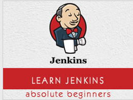

```
Roberto Nogueira  
BSd EE, MSd CE
Solution Integrator Experienced - Certified by Ericsson
```
# TutorialsPoint project



**About**

Learn everything you need to about the subject of this `Tutorialspoint` project.

[Homepage](http://www.tutorialspoint.com/jenkins/)

## Topics
```
Jenkins Tutorial
[ ] Home
[ ] Overview
[ ] Installation
[ ] Tomcat Setup
[ ] Git Setup
[ ] Maven Setup
[ ] Configuration
[ ] Management
[ ] Setup Build Jobs
[ ] Unit Testing
[ ] Automated Testing
[ ] Notification
[ ] Reporting
[ ] Code Analysis
[ ] Distributed Builds
[ ] Automated Deployment
[ ] Metrics and Trends
[ ] Server Maintenance
[ ] Continuous Deployment
[ ] Managing Plugins
[ ] Security
[ ] Backup Plugin
[ ] Remote Testing
Jenkins Useful Resources
[ ] Quick Guide
[ ] Useful Resources
[ ] Discussion
Selected Reading
[ ] Developer's Best Practices
[ ] Questions and Answers
[ ] Effective Resume Writing
[ ] HR Interview Questions
[ ] Computer Glossary
[ ] Who is Who
```
